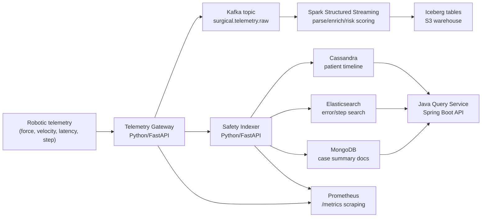

# Surgical Data Mesh Platform

Production-style reference architecture for **robotic surgery telemetry**: ingest high-frequency events, process streams, build a lakehouse, and serve low-latency safety insights.

This project is intentionally designed to demonstrate the exact engineering surface area common in modern healthcare data platforms: **Python + Java microservices**, **Kafka streaming**, **Spark + Iceberg**, **Cassandra/MongoDB/Elasticsearch storage patterns**, **AWS IaC**, and **testing discipline**.

## Why this project is strong

- Models a realistic operating-room telemetry workflow rather than a toy CRUD app.
- Uses a polyglot architecture: Python services for ingestion/indexing and a Java service for query APIs.
- Shows both batch-lakehouse thinking (Spark/Iceberg) and online serving (Cassandra/Elasticsearch/MongoDB).
- Includes practical engineering workflows: unit/integration tests, Docker, Kubernetes manifests, Terraform starter, and Prometheus metrics.

## Architecture



## Stack coverage map

- `Python`: telemetry gateway + safety indexer + Spark jobs
- `Java`: Spring Boot query service
- `AWS`: Terraform starter for S3/ECR/CloudWatch + AWS-ready deployment model
- `Kubernetes`: deployable manifests for all microservices
- `Airflow`: DAG included for Spark -> dbt -> data tests orchestration
- `dbt`: staging/mart models included with Snowflake profile template
- `Kafka`: raw telemetry stream transport
- `Flink/Spark`: Spark Structured Streaming implemented + Flink windowed alert reference module
- `Snowflake/Iceberg`: Iceberg lakehouse table write path implemented (Snowflake is downstream warehouse target)
- `Cassandra`: timeline backend interface and deployment profile
- `MongoDB`: document summary backend
- `Elasticsearch`: search backend
- `TDD + tests`: service-level unit/integration tests with CI
- `IaC`: Terraform + Kubernetes config
- `Metrics/Monitoring`: Prometheus endpoints and scrape config
- `Microservices`: ingest, indexer, and query services with independent deploy units

## Repository layout

```text
services/
  ingest-service/        # Python FastAPI telemetry gateway -> Kafka
  indexer-service/       # Python FastAPI indexer -> Cassandra/Elastic/Mongo
  query-service-java/    # Java Spring Boot read/query API
jobs/
  spark/                 # Spark Structured Streaming -> Iceberg
  flink/                 # Flink windowed alert reference flow
orchestration/
  airflow/dags/          # Airflow DAG for end-to-end scheduling
analytics/
  dbt/                   # dbt project with staging + marts
infra/
  terraform/             # AWS IaC starter (S3/ECR/CloudWatch)
  k8s/                   # Kubernetes manifests
monitoring/
  prometheus.yml         # Metrics scraping
scripts/
  demo_load.py           # Synthetic event generator
```

## Quick start

```bash
docker compose up --build
```

In a second shell:

```bash
python scripts/demo_load.py --count 75
curl "http://localhost:8081/search?q=sutur"
curl "http://localhost:8081/patients/pat-1/timeline"
curl "http://localhost:8082/api/health"
```

## Test commands

```bash
cd services/ingest-service && pytest -q
cd services/indexer-service && pytest -q
cd jobs && pytest -q
cd services/query-service-java && mvn test
```

## Engineering notes

- The service defaults to in-memory stores for local reliability; backend toggles allow Cassandra/Elasticsearch/MongoDB profiles without changing API contracts.
- Spark job writes are configured in canonical Iceberg style and designed for checkpointed exactly-once-like processing semantics.
- Terraform intentionally starts compact, so infra can grow iteratively (MSK/EMR/EKS modules can be layered next without rework).
